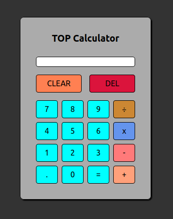

# The Odin Project - Calculator

## What is this?

A simple Calculator written in HTML, CSS and JavaScript. Based on the "The Odin Project" Foundation curriculum found [here](https://www.theodinproject.com/paths/foundations/courses/foundations/lessons/calculator).

## Features

- [x] Addition / Subtraction / Multiplication / Division
- [x] Floating point / Decimal number support
- [x] Negative Number support
- [x] CLEAR button to reset the calculator
- [x] DEL button to delete last entry
- [x] Shows last calculation after result
- [x] Keyboard control
- [x] Simple but nice UI that should fit all display sizes
- [x] subtle Animation when result is calculated

## Image

